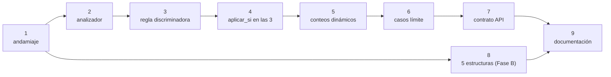

# Plan de implementación: tipo de documento y grupos excluyentes

**Estado**: aprobado, pendiente de ejecución
**Fecha**: 2026-09-28
**Rama prevista**: `semana6-tipo-documento` (se crea al ejecutar el Paso 1)
**Diseño asociado**: `docs/diseno/15_tipo_documento_grupos.md`

Cada paso es independiente y se pide de uno en uno.

## 1. Objetivo

Corregir el defecto por el que una tesis conforme se reporta en rojo, y dejar
preparada la incorporación de las 5 estructuras que el manual define y el motor
no tiene, sin exigir plantillas que la biblioteca no posee.

El problema y su evidencia están en el documento de diseño 15. En resumen: las 4
plantillas oficiales del repositorio salen en **rojo** con 5 errores bloqueantes,
2 de los cuales son estructuras de otros tipos de tesis y por lo tanto
**imposibles de corregir**.

## 2. Regla de oro

Ningún paso se da por terminado si `nix run .#test -- tests/ -v` no queda en
verde. Si un paso rompe la suite, se arregla antes de seguir.

## 3. Pasos

### Paso 1 — Andamiaje de dos fases (sin cambio de comportamiento)

**Objetivo**: la maquinaria de `expone` / `aplicar_si`, sin usarla todavía.
Cero cambios observables.

**Archivos**: `validator/models.py`, `validator/compilador.py`,
`validator/dsl_check.py`, `tests/`

**Qué hacer**

1. `RuleResult` gana `aplicable: bool = True`. Actualizar `to_dict()`.
2. `ReglaCompilada` lee `expone` y `aplicar_si` del YAML.
3. `CompilerDSL.ejecutar()` pasa a dos fases: la primera corre las reglas **sin**
   `aplicar_si` y acumula el contexto; la segunda corre el resto. Con ninguna
   regla usando `aplicar_si`, el resultado debe ser idéntico al actual.
4. `dsl_check.py`: validar que `aplicar_si` sea un mapa no vacío y que sus claves
   las exponga alguna regla. Error de linter si apunta a una clave inexistente.

**Verificación**

- 213 tests en verde.
- `aplicable` es `True` en todos los resultados.
- Un test nuevo del linter rechaza un `aplicar_si` colgado.

**Hecho cuando**: suite verde y el diff no altera ningún resultado de regla.

---

### Paso 2 — Analizador de detección de tipo

**Objetivo**: la lógica que decide de qué tipo es un documento, aún sin conectar
al reporte.

**Archivos**: `validator/analizadores.py`, `validator/compilador.py`,
`validator/dsl_check.py`, `tests/`

**Qué hacer**

1. Clase `DeteccionTipo` con los 3 niveles de la decisión 2 del diseño:
   declaración (Anexo 10), firmas con umbral, y sin determinar.
2. Precedencia por especificidad según la decisión 2 (informe antes que
   proyecto).
3. Normalización al comparar: mayúsculas, sin acentos, sin indentación.
4. Registrar en `SECCIONES_ANALIZADOR` y `_FABRICAS` de `compilador.py`.
5. `deteccion_tipo` en `_SECCIONES` de `dsl_check.py`, validando: `expone`
   presente, `evidencia` no vacía, `minimo >= 1`, tipos de `firmas` únicos.

**Verificación**

- Tests unitarios del analizador: los 8 tipos se detectan con un conjunto
  mínimo de títulos.
- Un título que no corresponde a ningún tipo devuelve "sin determinar".
- Suite verde.

**Hecho cuando**: el analizador se puede invocar sobre un DOCX y devuelve tipo,
evidencia y nivel.

---

### Paso 3 — Regla discriminadora en el YAML

**Objetivo**: que el tipo detectado aparezca en el reporte.

**Archivos**: `reglas_unt.yaml`, `tests/_mutations.py`,
`tests/test_propiedad.py`

**Qué hacer**

1. Añadir `deteccion_tipo_documento` con `severidad: warning`,
   `expone: tipo_documento` y las 8 firmas del diseño.
2. `_mutations.py`: entrada en `REGLAS` y mutación mínima que rompa la detección.
3. Confirmar que el documento del factory se detecta como `tinv_cuantitativo`.

**Verificación**

- 214 tests en verde (un caso paramétrico más).
- El reporte muestra "Tipo de documento detectado".
- **El semáforo no cambia**: es `warning`, no bloquea.

**Hecho cuando**: el reporte informa el tipo y nada más se altera.

---

### Paso 4 — `aplicar_si` en las 3 estructuras (este es el arreglo)

**Objetivo**: que dejen de aparecer los errores imposibles.

**Archivos**: `reglas_unt.yaml`, `tests/_mutations.py`,
`tests/test_propiedad.py`

**Qué hacer**

1. Añadir `aplicar_si: {tipo_documento: ...}` a las 3 reglas de estructura.
2. `EXCLUIDAS_BASE` pasa a vacío: las 2 estructuras alternativas dejan de
   evaluarse.
3. Renombrar `test_doc_bueno_pasa_45` → `test_doc_bueno_pasa_47_sin_fallos`.

**Verificación**

- Documento bueno: **47/47, cero fallos**.
- Las 5 plantillas oficiales: de 5 errores bloqueantes a **3**.
- Suite verde.

**Hecho cuando**: el defecto original está corregido y medido.

---

### Paso 5 — Conteos dinámicos en el reporte

**Objetivo**: que el resumen diga la verdad.

**Archivos**: `validator/engine.py`, `tests/`

**Qué hacer**

1. `build_report` agrega `total_evaluadas` y `reglas_no_aplicables` al resumen, y
   excluye las no aplicables de `resultados`.
2. El semáforo se sigue calculando sobre las aplicables (ya lo está por
   construcción).

**Verificación**

- Documento bueno: `total_evaluadas: 43`, `reglas_no_aplicables: 4`,
  `fallidos_error: 0`.
- Suite verde.

**Hecho cuando**: el resumen refleja lo evaluado y lo omitido.

---

### Paso 6 — Tipo no determinado y contradicción

**Objetivo**: los dos casos límite, sin huecos de seguridad.

**Archivos**: `validator/compilador.py`, `validator/engine.py`, `tests/`

**Qué hacer**

1. Sin tipo detectado → `tipo_documento_no_determinado`, severidad `error`,
   mensaje accionable; las 8 estructuras quedan no aplicables.
2. Declaración y firma contradictorias → `tipo_documento_contradictorio`.

**Verificación**

- Documento sin marcadores → **1** error claro, no 8.
- Documento contradictorio → 1 error claro.
- Suite verde.

**Hecho cuando**: ningún camino permite que un documento mal estructurado salga
en verde.

---

### Paso 7 — Contrato de API (coordinar con Integrante 1)

**Objetivo**: exponer lo nuevo sin romper el contrato publicado.

**Archivos**: `validator/api_models.py`, `docs/openapi_spec.json`,
`docs/CONTRATO_API.md`

**Qué hacer**

1. **Coordinar antes de empezar.** `api_models.py` es área de Integrante 1 y
   `resumen` cambia de semántica.
2. Campos nuevos en el resumen y el contexto del documento.
3. Regenerar `openapi_spec.json` con `scripts/generate_openapi.py` y commitearlo:
   el **CI verifica el drift**.
4. Actualizar `docs/CONTRATO_API.md`.
5. Avisar a Integrante 2: el frontend recibe un resumen dinámico.

**Verificación**

- `nix flake check` en verde, incluida la verificación de drift.

**Hecho cuando**: el contrato refleja el cambio y el CI lo confirma.

---

### Paso 8 — Fase B: las 5 estructuras que faltan

**Objetivo**: implementar lo que sí está definido en el manual, aunque no se
pueda probar contra documentos reales.

**Archivos**: `reglas_unt_pendientes.yaml` (nuevo), `docs/`

**Qué hacer**

1. Extraer los 5 esquemas del manual: proyecto cuantitativo (párr. 805-866),
   proyecto cualitativo (941-999), informe cuantitativo (1160-1213), informe
   cualitativo (1264-1311), TSP (1463-1499).
2. Escribir las 5 reglas con `aplicar_si` + `automata_secuencia`, usando
   `opcional: true` donde el manual lo indique.
3. Documentar los alias: `informe_cuantitativo` acepta "Tesis de investigación
   cuantitativa" y `informe_cualitativo` la variante cualitativa.
4. Registrar en el archivo que el manual exige 3.3/3.3 Aspectos generales para
   el TSP, y que esa exigencia ya la cubre la regla `indice_hojas_preliminares`.

**Verificación**

- El linter acepta el archivo (esto valida la **configuración**, no el
  comportamiento).
- Al cargar el archivo aparte, un documento cuantitativo deja aplicar solo su
  estructura.

**Hecho cuando**: las 5 reglas cargan, lintean y son revisables contra el
manual. **Sin pruebas de comportamiento, por decisión explícita** — no hay
plantillas para estos 5 tipos.

---

### Paso 9 — Documentación y cierre

**Archivos**: `docs/DSL.md`, `README.md`, `AGENTS.md`,
`docs/diseno/00_indice_diseno.md`, `docs/semana6_trabajo_ivanSanchezSil.md`

**Qué hacer**

1. `DSL.md`: secciones `deteccion_tipo`, `expone`, `aplicar_si`.
2. Índice de diseño: dar de alta el documento 15.
3. `README.md` y `AGENTS.md`: actualizar conteos.
4. Las 3 desviaciones entre plantilla y manual (`Discusión`,
   `Aspectos éticos`, `Conclusiones y Recomendaciones`) con la convención
   `EVALUADO:`.
5. Corregir el nombre de rama obsoleto `semana52-brechas-manual` en la bitácora
   de semana 6 y hacer commit de la bitácora.

**Verificación**: `nix flake check` en verde y `git status` limpio.

**Hecho cuando**: la documentación cuenta la misma historia que el código.

## 4. Orden y dependencias

La Fase A (pasos 1-7) es secuencial. La Fase B (paso 8) solo necesita el paso 1.

## 5. Fuera de alcance

- Módulo de IA (Fase C, posterior a este plan).
- Reglas por programa de estudio.
- OCR, correo, notificación.
- Plantillas reales de los otros tipos: **no las tiene la biblioteca**. Queda
  como petición formal pendiente, no como tarea.
