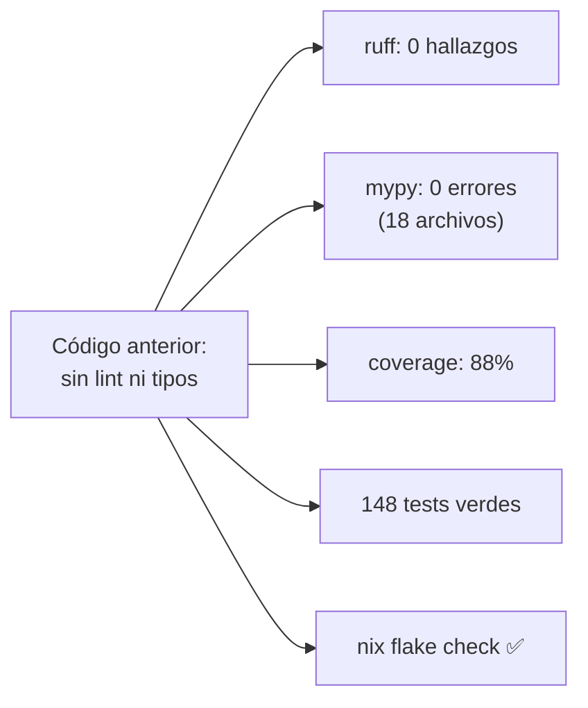
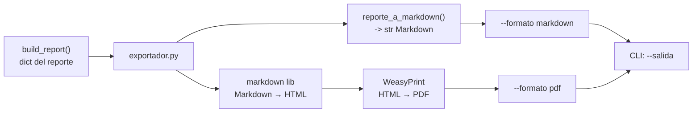
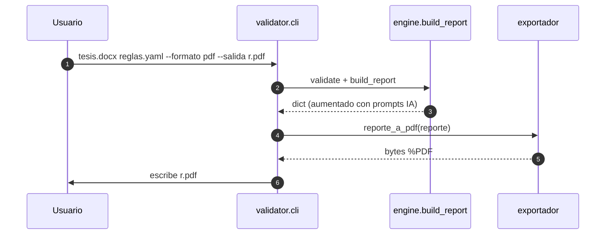

# Diseño — Calidad de ingeniería lab y exportación del reporte (tareas 15 y 16)

> Documento: `10_calidad_y_exportacion.md`
> Estado: ✅ **IMPLEMENTADA** (2026-09-16, Semana 4, rama `semana4`)
> Autor: IvanSanchezSil (Integrante 3 — Motor de reglas / DSL)
> Alcance: tareas **15** (calidad de ingeniería: ruff, mypy, coverage, pre-commit, CI)
> y **16** (exportación del reporte a Markdown/PDF) del
> [`PLAN_BACKLOG_FUTURO.md`](../PLAN_BACKLOG_FUTURO.md) (Fase 1).
> Relacionado: [`README.md`](../../README.md) · [`pyproject.toml`](../../pyproject.toml) · [`flake.nix`](../../flake.nix)

## 1. Contexto

Antes de estas tareas el repo **no tenía** ninguna herramienta de calidad de
código Python: solo `pytest` en el flake, `pyproject.toml` únicamente con
la config de pytest, **sin CI** (`.github/` no existía) y **sin linters/
typecheckers**. El reporte de validación solo se producía en JSON (motor) o
texto de terminal (CLI); no existía una forma legible de entregar/adjuntar
el resultado en una bitácora.

El backlog (`PLAN_BACKLOG_FUTURO.md`) las encuadraba como **Fase 1**
(independientes, bajo riesgo). Se ejecutaron juntas porque comparten
terreno: la tarea 16 introduce un módulo nuevo que debe pasar por la
cadena de calidad que monta la 15.

## 2. Tarea 15 — Calidad de ingeniería del motor

### 2.1 Herramientas elegidas (y por qué)

| Herramienta | Rol | Decisión |
|---|---|---|
| **ruff** | Linter + formateador (E/F/I/UP/W/B) | Un solo binario rápido, reemplaza a flake8+black+isort |
| **mypy** | Typechecker (modo moderado) | Detecta errores de tipos antes de runtime sin exigir refactor estricto |
| **coverage** (vía `pytest-cov`) | Mide % de código ejecutado por tests | **Solo reporta**, sin umbral bloqueante (decisión 4 del plan) |
| **pre-commit** | Hooks locales (ruff, mypy, EOF, whitespace) | Calidad en el commit, sin infra extra (corre en Nix) |
| **GitHub Actions + Nix** | CI en push/PR | **Todo en Nix** (decisión 1): se re-usa el mismo entorno de desarrollo |

Decisión **mypy moderado** (no `strict`): el código usa `-> dict`, `etree`,
`Any | None`; estricto exigiría anotar las 2663 líneas de `validator/`.
Moderado anota lo principal y tolera librerías sin stubs.

### 2.2 Cambios realizados

```mermaid
flowchart LR
    subgraph CONFIG["Configuración"]
        P1["pyproject.toml<br/>[tool.ruff] [tool.mypy]<br/>pytest --cov"]
        P2["flake.nix<br/>+ ruff, mypy, coverage,<br/>pytest-cov, pre-commit"]
        P3[".pre-commit-config.yaml"]
        P4["ci.yml (GitHub Actions)"]
    end
    subgraph CODIGO["Código corregido"] 
        C1["validator/ (11 archivos)"]
        C2["scripts/ (4)"]
        C3["tests/ (9)"]
    end
    subgraph VERIF["Verificación"]
        V1["nix flake check<br/>pytest + ruff + mypy"]
        V2["coverage 88%<br/>148 tests verdes"]
    end

    P1 --> CODIGO
    P2 --> P1
    P3 --> CODIGO
    P4 --> V1
    CODIGO --> VERIF
```

1. **`flake.nix`**: agregados `ruff`, `mypy`, `pre-commit`, `pytest-cov`,
   `coverage`, `markdown`, `weasyprint`. El check `default` ahora ejecuta
   `pytest --cov` + `ruff check` + `mypy` (antes solo pytest).
2. **`pyproject.toml`**: secciones `[tool.ruff]` (target py314, line-length 100,
   reglas E/F/I/UP/W/B, `E501` ignorado, `fastapi.File/Query/Path` como
   inmutables en defaults), `[tool.mypy]` (moderado, `warn_unused_ignores`,
   `check_untyped_defs`), `addopts = "--cov=validator --cov-report=term-missing"`.
3. **Lint/format**: `ruff check --fix` + `ruff format` sobre toda la base.
   Se corrigieron **220+ hallazgos** (208 iniciales al `flake check`), de los
   cuales 11 requirieron corrección manual por no ser auto-fixables o ser
   decisiones (ver 4.1).
4. **Mypy**: 9 errores corregidos en 5 archivos (ver 4.1).
5. **`.pre-commit-config.yaml`** y **`.github/workflows/ci.yml`** (Nix con
   `install-nix-action` + `cachix`).

### 2.3 Resultado de calidad



## 3. Tarea 16 — Exportación del reporte a Markdown/PDF

### 3.1 Diseño

Nuevo módulo `validator/exportador.py` con dos salidas:

| Función | Entrada → Salida | Cómo |
|---|---|---|
| `reporte_a_markdown(reporte)` | `dict` → `str` (Markdown) | Semáforo, resumen, tabla de reglas, detalle de fallidas, sección de prompts IA |
| `reporte_a_pdf(reporte)` | `dict` → `bytes` (PDF) | Markdown → HTML (lib `markdown`) → PDF (**WeasyPrint**) |

**Elección del motor PDF** (decisión 3): **WeasyPrint** se eligió por
calidad de render (CSS real, tablas, acentos) frente a las otras opciones
evaluadas y disponibles en nixpkgs:

| Opción | Calidad | Costo | Decisión |
|---|---|---|---|
| **weasyprint** (Markdown→HTML→PDF) | ⭐⭐⭐ (CSS real) | dep nueva | ✅ elegida |
| reportlab | ⭐⭐ (control fino, más código) | dep nueva | descartada |
| pymupdf.Story | ⭐ (HTML simple) | sin dep extra | descartada |



### 3.2 Integración en la CLI



- `--formato {json,markdown,pdf}` + `--salida ruta`.
- `--json` se mantiene como atajo (`--formato json`) — **compatibilidad
  intacta**.
- PDF exige `--salida` (no puede ir a stdout).

**Alcance deliberado (solo CLI)**: exponer `formato` en `POST /validar`
cambiaría el contrato de la API (`CONTRATO_API.md` → v1.2 + `openapi_spec.json`)
y es territorio del **compañero de API/frontend** (decisión 6). Queda
marcado como pendiente para él en `PLAN_BACKLOG_FUTURO.md`.

## 4. Refactores inducidos (implicados por la cadena de calidad)

### 4.1 Correcciones manuales de ruff (11)

| Regla | Archivo(s) | Cambio |
|---|---|---|
| UP042 `str, Enum` → `StrEnum` | `models.py`, `api_models.py` | `class Severity(StrEnum)`, `class SeveridadAPI(StrEnum)` |
| B904 `raise ... from` | `api.py` (×3) | encadenar excepción para no perder contexto |
| B007 variable de loop sin usar | `automata.py`, `test_paridad_formatos.py` | `_hacia`, `_rid` |
| E741 nombre ambiguo `l` | `scripts/`, `tests/` | renombrar a `legacy_res`/`dsl_res` |
| B905 `zip` sin `strict` | `test_api_contract.py` | `zip(..., strict=True)` |
| B008 `File/Query` en defaults FastAPI | `api.py` | tolencia vía `extend-immutable-calls` (no es bug) |

### 4.2 Correcciones de mypy (9 en 5 archivos)

| Archivo | Corrección |
|---|---|
| `dsl_check.py` | filtrar `None`/`Any` antes de `sorted`; anotar `epsilon_ady: dict[str, list[str]]` |
| `tokenizer.py` | `val` opcional → `estilo = str(val) if val is not None else ""` |
| `compilador.py` | `_FABRICAS: dict[str, Callable[[dict], Analizador]]` (Analizador es abstracto) |
| `ocr_pdfs.py` | `for i in range(len(doc)): page = doc[i]` (Document no iterable por tipos) |
| `api.py` | `severidad=SeveridadAPI(r.severity.value)` |

### 4.3 Migración de anotaciones

`ruff` (UP006/UP035) normalizó `List[str]`/`Optional[str]` → `list[str]`/
`str | None` y `typing.*` → `collections.abc` en **toda la base** (Python 3.14).

## 5. Evidencias producidas

| Evidencia | Archivo | Competencia curricular |
|-----------|---------|------------------------|
| Config de calidad | `pyproject.toml`, `flake.nix` | Ingeniería de Software II (tooling) |
| Pre-commit | `.pre-commit-config.yaml` | Ingeniería de Software II (calidad en commit) |
| CI con Nix | `.github/workflows/ci.yml` | Ingeniería de Software II (integración continua) |
| Exportador Markdown/PDF | `validator/exportador.py` | Ingeniería de Software I (reportes de producto) |
| CLI export | `validator/cli.py` (`--formato/--salida`) | Ingeniería de Software I |
| Refactor de tipos | `validator/*.py`, `scripts/*.py` | Fundamentos de Programación (tipado moderno) |
| Tests del exportador | `tests/test_exportador.py` (6 tests) | Ingeniería de Software II |

## 6. Dificultades y aprendizajes

- **208 errores iniciales de ruff**: la base nunca se linteó; la gran
  mayoría (170) eran auto-fixables de tipado (`List`→`list`) y de imports.
  Los 11 restantes eran decisiones reales (StrEnum, `raise from`, nombres).
- **Mypy con `Any | None`**: lxml devuelve `Any`, y operar con eso en
  `sorted()`/análisis requiere filtros explícitos (`isinstance(n, str)`)
  para que mypy no infiera `None`.
- **`_FABRICAS` abstracto**: el dict de fábricas exige anotar `Callable`
  porque `Analizador` es una clase abstracta — sin la anotación, mypy se
  queja de instanciar una clase abstracta.
- **PDF**: WeasyPrint resuelve acentos y tablas de forma limpia; la ruta
  `python -m validator.exportador` sirve como utilidad standalone desde
  un JSON (probado: `--formato pdf`, 58 KB, `%PDF` válido).
- **Banner de `nix develop` en stdout**: los comandos que imprimían a
  stdout (CLI) se probaron con `--salida` a archivo para no colisionar con
  el mensaje del shellHook.

## 7. Pendiente

- [ ] **Tarea 13** (benchmark con tesis reales) — requiere tesis anonimizadas (aún no se poseen).
- [ ] **Tarea 14** (rendimiento 150+ páginas) — requiere documentos grandes reales.
- [ ] **API**: exponer `formato` en `POST /validar` — **delegado al compañero de API/frontend** (decisión 6).
- [ ] Subir umbral de coverage bloqueante cuando se consolide (hoy solo reporta).