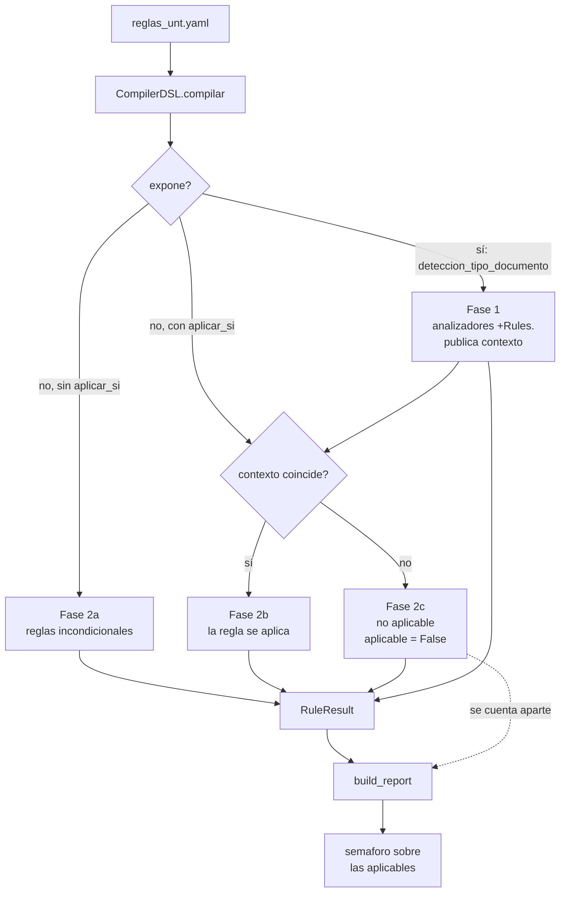

# 15. Tipo de documento y grupos excluyentes de reglas

- **Fecha**: 2026-09-28
- **Estado**: diseño aprobado, pendiente de implementación
- **Commits**: — (Semana 6 — Fase A)
- **Alcance**: Fase A (mecanismo) / Fase B (5 estructuras)

## Problema

El manual institucional define **8 tipos de documento**, cada uno con estructura
formal obligatoria, y son **mutuamente excluyentes**: una tesis es de un solo
tipo. El motor evalúa hoy las 3 reglas de estructura **de forma incondicional**,
sin que una regla sepa de las demás. Un documento que cumple correctamente su
estructura falla las estructuras de los otros tipos.

## Evidencia

Las 4 plantillas oficiales del repositorio, evaluadas con `reglas_unt.yaml`:

| Documento | `estructura_tinv_cuantitativo` | semáforo |
|---|---|---|
| `EDUCACION INICIAL-PLANTILLA` | **PASA** | **ROJO** |
| `SEGUNDA ESPECIALIDAD EN EDUCACION TEMPRANA` | **PASA** | **ROJO** |
| `SEGUNDA ESPECIALIDAD EN ESTIMULACIÓN` | **PASA** | **ROJO** |
| `TECNOLOGIA EDUCATIVA-ADMINISTRACION Y GERENCIA` | **PASA** | **ROJO** |
| `TECNOLOGIA EDUCATIVA-INFORMATICA EDUCATIVA` | **PASA** | **ROJO** |

Las 5 fallan con los mismos 5 errores, 2 de los cuales son **imposibles de
corregir**:

```
- caratula_autores_mayusculas_sin_negrita     (desviación real)
- estructura_tinv_cualitativo                  ← imposible: es cuantitativa
- estructura_tinv_revision_literatura          ← imposible: no es revisión
- palabras_clave_minimo                        (desviación real)
- proyecto_caratula_texto                     (desviación real)
```

Como el semáforo se calcula sobre **todos** los errores
(`validator/engine.py:104`), una tesis perfectamente conforme se reporta en
rojo, y el estudiante no tiene forma de resolverlo: son las estructuras de otros
tipos de tesis. El mismo defecto aparece en el factory:
`test_doc_bueno_pasa_45` falla exactamente 2 reglas, los esquemas alternativos
(`tests/test_propiedad.py:90`).

Este es un defecto de correctitud, no una funcionalidad faltante.

## Alcance de los tipos en el manual

El Capítulo II (índice párr. 75-90) define estructura formal para exactamente
**8 tipos**. El **Anexo 10 "Declaración jurada"** (párr. 1825-1835) ofrece 11
casillas porque usa otro vocabulario:

| Casilla del Anexo 10 | Tipo canónico | Decisión |
|---|---|---|
| TRABAJO DE INVESTIGACIÓN CUANTITATIVO | `tinv_cuantitativo` | 1:1 |
| TRABAJO DE INVESTIGACIÓN CUALITATIVO | `tinv_cualitativo` | 1:1 |
| TRABAJO DE INVESTIGACIÓN DE REVISIÓN DE LA LITERATURA | `tinv_revision_literatura` | 1:1 |
| PROYECTO DE INVESTIGACIÓN CUANTITATIVO | `proyecto_cuantitativo` | 1:1 |
| PROYECTO DE INVESTIGACIÓN CUALITATIVO | `proyecto_cualitativo` | 1:1 |
| INFORME DEL PROYECTO — cuantitativo | `informe_cuantitativo` | **alias**: "Tesis de investigación cuantitativa" |
| INFORME DEL PROYECTO — cualitativo | `informe_cualitativo` | **alias**: "Tesis de investigación cualitativa" |
| TRABAJO DE SUFICIENCIA PROFESIONAL | `tsp` | 1:1 |
| TRABAJO DE INVESTIGACIÓN DE LA PRÁCTICA PROFESIONAL (p1828) | — | **No se considera.** El manual no define estructura formal para él |

Las casillas "Tesis de investigación" **no son un noveno tipo**: designan los
mismos informes de investigación con otro nombre. `TESIS` es el término que el
manual emplea para el trabajo de título profesional (párr. 1076-1077), mientras
que "Informe del Proyecto" es como lo nombra el Capítulo II. Quedan **8 tipos
con estructura definida y ningún hueco pendiente** en el manual.

## Solapamiento entre estructuras

Comparación de las secciones de los 8 esquemas del manual (secciones autoritativas,
párr. 276-329, 381-421, 537-567, 805-866, 941-999, 1160-1213, 1264-1311, 1463-1499),
por coeficiente de Jaccard:

| Par | Solapamiento |
|---|---|
| Proyecto Cuant. ↔ Proyecto Cual. | 65% |
| Trabajo Cuant. ↔ Trabajo Cual. | 57% |
| Trabajo Cual. ↔ Informe Cual. | 57% |
| Informe Cuant. ↔ Informe Cual. | 50% |
| Trabajo Cuant. ↔ Informe Cual. | 45% |
| **Proyecto ↔ Trabajo** (cualquier par) | **5-12%** |
| **TSP ↔ cualquiera** | 24-29% (el más aislado) |

Conclusión: los pares cuantitativo/cualitativo de una misma familia se parecen
lo bastante como para esperar una abstracción, pero **las familias son casi
opuestas** (un proyecto y un trabajo de investigación comparten menos del 12%) y
el TSP no se parece a nada. Se opta por **8 reglas separadas** reutilizando el
`automata_secuencia` existente con `opcional: true`: más declarativo, más
auditable contra el manual, y sin un concepto nuevo en el DSL.

## Detección del tipo

### Tres niveles, en orden de preferencia

| Nivel | Fuente | Fiabilidad |
|---|---|---|
| 1. **Declarado** | Casilla marcada del Anexo 10 (párr. 1825-1835) | Exacta |
| 2. **Inferido** | Firmas estructurales (`evidencia` + `minimo`) | Alta |
| 3. **Sin determinar** | Ninguna de las anteriores | — |

El Anexo 10 es un formulario con casillas donde el autor **declara** su tipo. Si
el documento incluye esa declaración firmada, el tipo no se infiere: se lee. Las
4 plantillas del repositorio no incluyen el Anexo 10 (sus anexos son del 1 al 7),
así que para ellas se usa el nivel 2.

Si los niveles 1 y 2 coinciden se usa el declarado. Si **contradicen** →
`tipo_documento_contradictorio`. Sin nivel 1 ni 2 → `tipo_documento_no_determinado`.

### Precedencia entre Informe y Proyecto

El manual define el informe como "la versión revisada del proyecto de
investigación que se redacta una vez concluido el estudio" (párr. 1109, 1222). Un
documento final contiene marcadores de ambos. Las firmas de informe son más
específicas, por lo que se evalúan **antes** y ganan.

## Decisiones

1. **El tipo lo decide el motor, de forma determinista.** No la IA. El semáforo
   bloquea una entrega y no puede depender de un clasificador probabilístico cuyo
   resultado cambie entre ejecuciones. La IA (módulo del plan de prácticas)
   explica y prioriza; no decide el rojo/verde.

2. **Tipo no determinado produce un error explícito, no silencio.** Es la
   decisión de seguridad: si el motor no reconoce el tipo y omite las 8
   estructuras, una tesis con la estructura equivocada saldría **en verde sin
   revisión**. Se emite un único error accionable en vez de 8 errores falsos.

3. **No se añade rigidez al chequeo de estructura.** Se conserva
   `reconocimiento: greedy`. Motivo verificado: la plantilla oficial de
   `tinv_cuantitativo` incluye tres secciones que el manual **no** exige para ese
   tipo:

   | Sección en la plantilla | ¿El manual la pide para Trabajo Cuantitativo? |
   |---|---|
   | `Discusión` | No — "Análisis y discusión" solo figura para el cualitativo (p370, p410) y los informes (p1147, 1194, 1253, 1294) |
   | `Aspectos éticos` | No — el manual solo lo menciona para Proyecto (p833, p969) |
   | `Conclusiones y Recomendaciones` | No — para ese tipo el manual pide solo `CONCLUSIONES` |

   Prohibir secciones extra haría fallar la propia plantilla de la biblioteca, y
   el estudiante que la siga al pie de la letra sería sancionado. Se documentan
   con la convención `EVALUADO:` ya usada en el YAML.

   El **orden sí está garantizado**: `DFA.reconocer` avanza con `pos = found + 1`
   (`validator/automata.py:110-119`), por lo que una sección invertida no
   encuentra su patrón y la regla falla. Greedy detecta secciones faltantes e
   invertidas; ignora las sobrantes.

4. **La detección se muestra en el reporte, con `severidad: warning` y siempre
   aprobada.** Se evita crear un valor de severidad nuevo porque eso tocaría
   `api_models.py` y el contrato de la API, que es área de Integrante 1. El
   estudiante ve por qué se aplicó una estructura y no las otras:

   ```
   • Tipo de documento detectado: Trabajo de Investigación Cuantitativo
     Motivo: "VARIABLE(S) Y OPERACIONALIZACIÓN", "POBLACIÓN Y MUESTRA"
   – estructura_tinv_cualitativo   no aplica a tu tesis
   ```

5. **Los conteos del reporte son dinámicos.** En una tesis cuantitativa se
   evalúan 43 de 47 reglas. Un total fijo haría creer al estudiante que 4 reglas
   se cumplieron cuando en realidad no se miraron. Consecuencia: `resumen` cambia
   de semántica y requiere regenerar `openapi_spec.json` (el CI verifica el
   drift).

## Superficie DSL

Regla discriminadora (fase 1, publica el contexto):

```yaml
- id: deteccion_tipo_documento
  tipo: deteccion
  severidad: warning          # siempre aprueba; informa, no bloquea
  valor_esperado: >
    uno de: tinv_cuantitativo, tinv_cualitativo, tinv_revision_literatura,
    proyecto_cuantitativo, proyecto_cualitativo, informe_cuantitativo,
    informe_cualitativo, tsp
  ubicacion: 'Capítulo II — esquemas formales por tipo de título (párr. 75-90)'
  fuente: MANUAL REVISADO TERCERA VERSION OBSERVACIONES 11-07-2025.docx
  cita: 'Cada título profesional exige un esquema formal distinto'
  deteccion_tipo:
    expone: tipo_documento          # clave publicada en el contexto
    declaracion:
      anexo: 'Anexo 10 — Declaración jurada (párr. 1825-1835)'
    firmas:                          # en orden de especificidad (decisión 2)
      - tipo: tsp
        evidencia: ['SECUENCIA DIDÁCTICA', 'SUSTENTO PSICOPEDAGÓGICO',
                     'SUSTENTO TEÓRICO CIENTÍFICO']
        minimo: 2
      - tipo: informe_cualitativo
        evidencia: ['SITUACIÓN PROBLEMATIZADA', 'PARTICIPANTES',
                     'INSTRUMENTOS USADOS EN LA RECOLECCIÓN']
        minimo: 2
      - tipo: informe_cuantitativo
        evidencia: ['SITUACIÓN PROBLEMATIZADA', 'DISEÑO DE CONTRASTACIÓN',
                     'OPERACIONALIZACIÓN DE LAS VARIABLES']
        minimo: 2
      - tipo: proyecto_cuantitativo
        evidencia: ['PLAN DE INVESTIGACIÓN', 'RECURSOS Y MATERIALES',
                     'LÍNEA DE INVESTIGACIÓN']
        minimo: 2
      - tipo: proyecto_cualitativo
        evidencia: ['SELECCIÓN DE PARTICIPANTES', 'ESCENARIO',
                     'UNIDAD DE ANÁLISIS']
        minimo: 2
      - tipo: tinv_revision_literatura
        evidencia: ['ESTADO DEL ARTE', 'TÉCNICAS DE PROCESAMIENTO DE DATOS']
        minimo: 1
      - tipo: tinv_cualitativo
        evidencia: ['DEFINICIÓN DE TÉRMINOS', 'CATEGORIZACIÓN']
        minimo: 1
      - tipo: tinv_cuantitativo
        evidencia: ['VARIABLE', 'POBLACIÓN Y MUESTRA', 'INSTRUMENTO']
        minimo: 1
    minimo_global: 1
```

Reglas de estructura (fase 2, condicionales):

```yaml
- id: estructura_tinv_cualitativo
  tipo: secuencia
  aplicar_si:
    tipo_documento: tinv_cualitativo
  automata_secuencia: ...
```

La mecánica es genérica: cualquier regla puede `expone: <clave>` y cualquier otra
`aplicar_si: {<clave>: <valor>}`. No está cableada a tipos de tesis, así que más
adelante admite `aplicar_si: {programa: educacion_inicial}` sin cambios en el
motor.

## Arquitectura: evaluación en dos fases



## Cambios por archivo

| Archivo | Cambio | Área |
|---|---|---|
| `validator/analizadores.py` | Analizador `DeteccionTipo` (declaración + firmas + precedencia) | Int3 |
| `validator/compilador.py` | `expone` / `aplicar_si` en `ReglaCompilada`; `ejecutar()` en dos fases | Int3 |
| `validator/models.py` | `RuleResult.aplicable: bool = True`; contexto del documento | Int3 |
| `validator/dsl_check.py` | Sección `deteccion_tipo` + integridad referencial de `aplicar_si` | Int3 |
| `validator/engine.py` | `build_report`: no aplicables y total evaluadas | Int3 |
| `reglas_unt.yaml` | Regla discriminadora + `aplicar_si` en las 3 estructuras | Int3 |
| `tests/_mutations.py`, `test_propiedad.py` | Mutación; `EXCLUIDAS_BASE` a vacío | Int3 |
| `validator/api_models.py` | Campos nuevos en el resumen | **Int1 — coordinar** |
| `docs/CONTRATO_API.md`, `openapi_spec.json` | Regenerar (CI verifica el drift) | **Int1 — coordinar** |

## Fases

| Fase | Contenido | Resultado verificable |
|---|---|---|
| **A** | Discriminador + `aplicar_si` en las 3 existentes | `test_doc_bueno_pasa_47`, cero fallos; la plantilla pierde 2 de 5 errores bloqueantes |
| **B** | 5 estructuras nuevas en `reglas_unt_pendientes.yaml` | Reglas cargadas y revisables, **fuera** de la suite |

**Por qué las 5 van en un archivo aparte.**
`tests/test_propiedad.py:68` exige `set(a) == set(b) == set(REGLAS)`: toda regla
del YAML principal necesita mutación en `_mutations.py`. Además `ESTRUCTURA`
(línea 44) es una constante escrita a mano con los 3 ids actuales; sin
actualizarla, las 5 nuevas se compararían por su `found`, que incluye un contador
`headings=N` inestable ante cualquier cambio de encabezados. No existe hoy la
forma de "implementar sin probar" dentro de `reglas_unt.yaml`.

## Validación de las 5 estructuras nuevas

Las 4 plantillas del repositorio cubren **un solo tipo** (las 4 son
`tinv_cuantitativo` y las 4 pasan esa misma regla). No existe plantilla para los
otros 7 tipos y la biblioteca no las tiene:

| Tipo | Plantilla real |
|---|---|
| `tinv_cuantitativo` | 4 documentos |
| los otros 7 | ninguna |

Por eso las 5 estructuras de la Fase B se **implementan pero no se prueban contra
documentos reales**. Lo que sí se verifica es que la configuración carga y
lintea. Cuando la biblioteca facilite plantillas, se integran a la suite.

## Impacto esperado en los tests

| Test | Antes | Después |
|---|---|---|
| `test_doc_bueno_pasa_45` | 45/47, 2 fallos | 47/47, 0 fallos |
| `ESTRUCTURA` | 3 ids | 3 ids (las 5 nuevas en el archivo aparte) |
| Plantillas oficiales | 5 errores bloqueantes | 3 errores bloqueantes |
| Suite | 213 tests | 215 tests (2 nuevos: detección indeterminada y contradictoria) |

## No-alcance

- El módulo de IA (explicación y priorización del diagnóstico) es **Fase C**,
  posterior a este trabajo.
- Reglas por programa de estudio. Nota para el futuro: `caratula_linea_investigacion`
  ya embebe un catálogo de 46 líneas, y el catálogo del RCU-274 es por programa.
  `aplicar_si` admite un discriminador `programa` con el mismo mecanismo, pero
  **es un eje distinto al tipo de documento** y no debe mezclarse.
- OCR, correo y notificación: fuera de alcance.

## Mapeo académico (LFA / Compiladores)

- **LFA** — el grupo exclusivo es una **clasificación de lenguaje con
  reconocimiento de cadena**: la fase 1 es un DFA sobre los títulos del documento
  que devuelve un único símbolo del alfabeto de tipos; la fase 2 ejecuta un
  autómata distinto según ese símbolo. Es la construcción de una *máquina de
  Moore* para la función "tipo de documento".
- **Compiladores** — el contexto es un **símbolo en la tabla de símbolos**:
  `deteccion_tipo_documento` es la regla de producción que emite el token `TIPO`
  hacia el resto del programa, y `aplicar_si` es la **selección de camino en el
  árbol sintáctico** en tiempo de compilación.
- **Estructura de Datos** — evaluación en dos fases con paso de contexto, y
  `O(n)` sobre el número de reglas en la fase 2.
